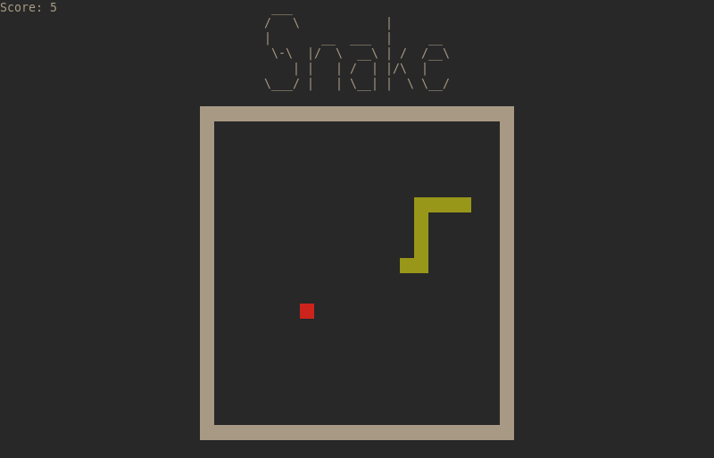

# Ncurses Snake

The classic game "Snake" written in C using the ncurses library.

# Files

cargs.txt: Stores compile time arguments.

rargs.txt: Stores runtime arguments.

# Known issues

When the game starts, random characters will sometimes appear.
